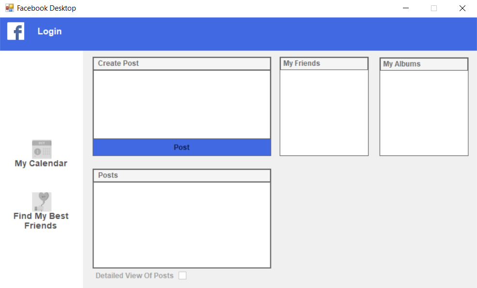
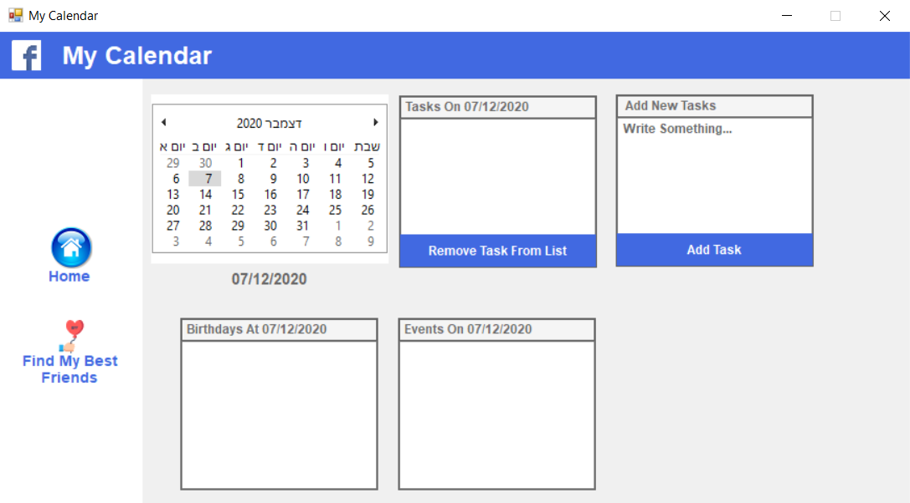
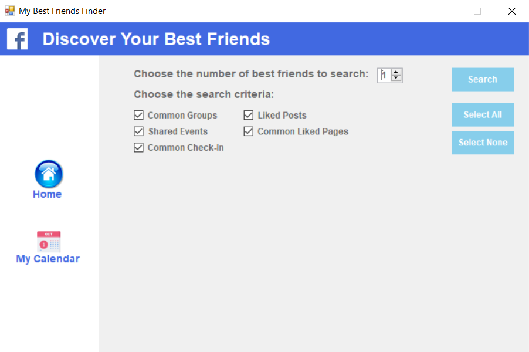

# Facebook-Desktop-App

Facebook Desktop App is desktop application I develop using WinForms with C# and facebook Graph API implementing various design patterns.
The app show to the user his gerenal information, and new features: 
* Find the user best friends.
* Calendar that synchronized with all user birthdays and events.

Custom Facebook feed desktop application created using Facebook API with C# and WinForms while implementing various design patterns.

Super Duper Market (SDM) is a web platform that I develop for store-owners to upload their stores and get all the infomation of the orders that was orderd from their stores, and for customers to order groceries for lowest cost by ordering each product from the store that sale it for the lowest price. 

## Screenshots






## Built With

* [C#](https://docs.microsoft.com/en-us/dotnet/csharp/) -  is a general-purpose, multi-paradigm programming language encompassing static typing, strong typing, lexically scoped, imperative, declarative, functional, generic, object-oriented (class-based), and component-oriented programming disciplines.

* [Visual Studio ](https://visualstudio.microsoft.com/) - visual studio is  an integrated development environment (IDE) from Microsoft

* [Graph API](https://developers.facebook.com/docs/graph-api) - Graph API is the primary way for apps to read and write to the Facebook social graph


```
